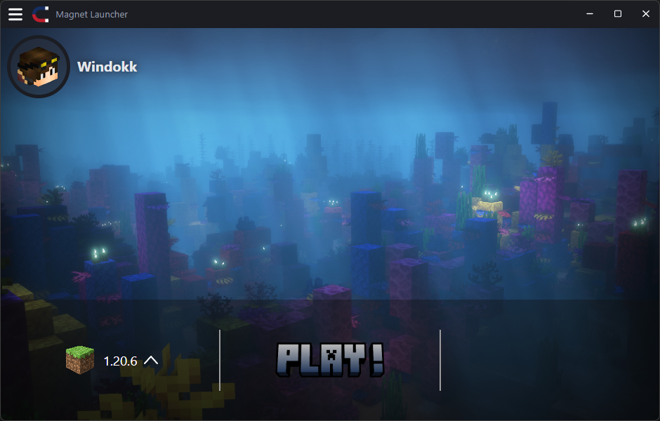
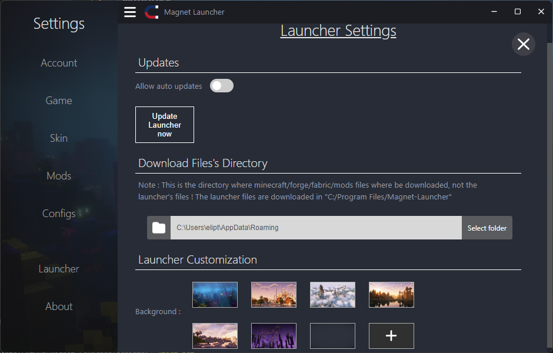
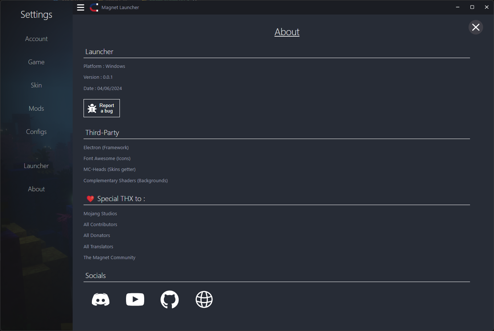

<div align="center">


# Welcome to the Magnet Launcher !


<br>
<a href="#to-do-list-alpha-001"></a>
<a href="LICENSE"></a>

<br>
A Minecraft Java Launcher in JS built with Electron
<br>
<a href="https://github.com/Windokk/Magnet-Launcher/wiki">Wiki</a>&nbsp;&nbsp;
<a href="https://github.com/Windokk/Magnet-Launcher/wiki/Getting-Started">Getting Started</a>&nbsp;&nbsp;
<a href="https://github.com/Windokk/Magnet-Launcher/issues/new">Report a bug</a>&nbsp;&nbsp;
<a href="https://github.com/Windokk/Magnet-Launcher/issues/new">Suggest an enhancement</a>&nbsp;&nbsp;
<br>
</div>


> [!WARNING]  
> The Launcher is currently in a pre-alpha state. A lot of features are missing and you may exepct a lot of bugs.


<div align="center">
## Screenshots


<br>

<br>

<br>

<br>

</div>

## User documentation

*In Progress*

*Is in the [wiki](https://github.com/Windokk/Magnet-Launcher/wiki) tab*

# Developpement

> [!NOTE]
> Make sure to have Node.js 20.14 or higher installed on your local machine before starting any developpement work

## Developer Documentation

*In Progress*

## Build and run locally (Windows)

Clone the project

```bash
  git clone https://github.com/Windokk/Magnet-Launcher.git
```

(Or clone it from the same url with Github Desktop)

Install Electron and Electron-builder

```batch
  npm install --save-dev electron
  npm i --save-dev electron-builder
```

Go to the project's scripts directory

```batch
  cd Magnet-Launcher/scripts
```

Run the build-and-run file

```batch
  build-and-test.bat
```

This will build the installer and the packaged app, then run the packaged app.

To only run the app :

```batch
  build.bat
```

To only build the packaged app :

```batch
  test.bat
```

## Build and run locally (Linux)

## Contributing

> ### Legal Notice
> When contributing to this project, you must agree that you have authored 100% of the content, that you have the necessary rights to the content, and that the content you contribute may be provided under the project license.

We welcome contributions to this project! To ensure a smooth collaboration, please follow these guidelines:

### General Guidelines
- **Respect others**: Maintain a friendly and respectful environment. Harassment, discrimination, and inappropriate behavior will not be tolerated.
- **Code Optimization**: Strive to make your code as optimized and efficient as possible.
- **Indentation**: Do not use spaces for indentation. Use tabs instead. 😾
- **Referencing**: Always provide references for code, images, or any other content that is not originally yours.

### Recommended Tools
- It is strongly recommended to use [VS Code](https://code.visualstudio.com/) for modifying the project. It provides a robust environment with great support for various programming languages and tools.

### Submitting Contributions
1. **Fork the Repository**: Create a personal fork of the repository on GitHub.
2. **Clone Your Fork**: Clone your fork to your local machine.
3. **Create a Branch**: Create a new branch for your changes.
4. **Make Changes**: Implement your changes in this branch.
5. **Commit Changes**: Commit your changes with a clear and descriptive commit message.
6. **Push to GitHub**: Push your changes to your fork on GitHub.
7. **Submit a Pull Request**: Submit a pull request to the main repository. Be sure to describe the changes you have made and reference any related issues or pull requests.

### Review Process
All contributions will be reviewed by project maintainers. Feedback may be provided, and revisions might be requested. We appreciate your patience and cooperation during the review process.

Thank you for contributing to our project!

## Resources Used

- Electron JS (Main App Framework) : [ElectronJS](https://www.electronjs.org/)
- Font Awesome (Icons) : [Font Awesome](https://fontawesome.com/)
- MC-Heads (Skins getter) : [MC-Heads](https://mc-heads.net/)
- Complementary Shaders (Backgrounds) : [Complementary Shaders](https://www.complementary.dev/shaders/)

## Authors

- [@Windokk](https://github.com/Windokk)

## License

[](https://www.gnu.org/licenses/gpl-3.0.html)


NOT AN OFFICIAL MINECRAFT [PRODUCT/SERVICE/EVENT/etc.]. NOT APPROVED BY OR ASSOCIATED WITH MOJANG OR MICROSOFT